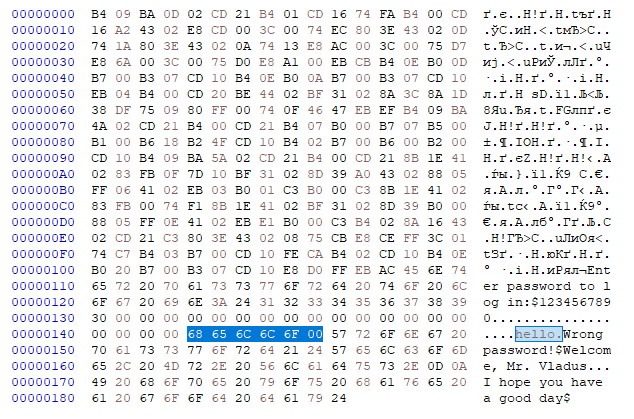
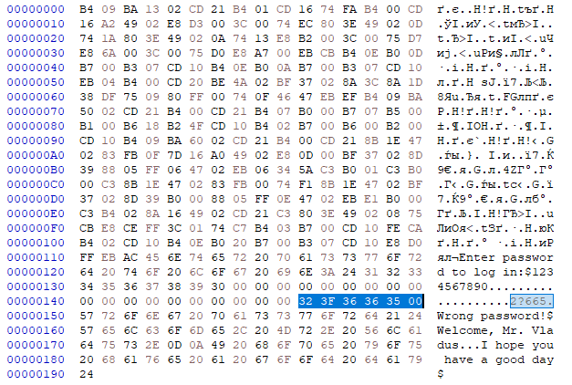

# COM program

These are two versions of simple authentication program: one that encrypts the password and one that does not. 

## Usage

To compile the assembly programs, use the make.bat script. Make sure you have installed `MASM32`.  
`make.bat <name>` - put a name without an extention  

By default, it compiles main.asm, so you can just run  
`make.bat`

Do not forget to move the file you want to compile into make.bat directory

### Hex Viewer

The hex viewer program allows you to view the contents of binary files in a hexadecimal format.
Here is how you can guess the password by looking at hex format of the file.

With encrypted program, this won't work directly:

